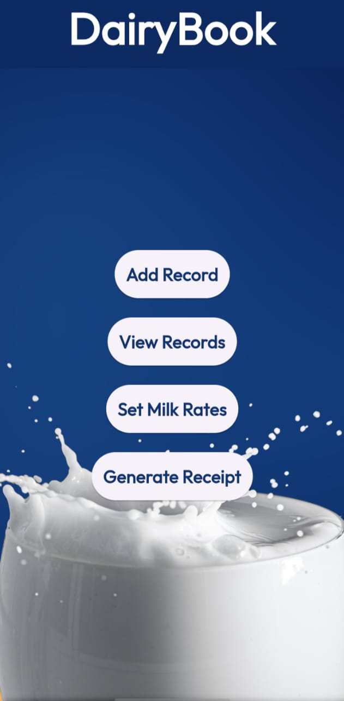
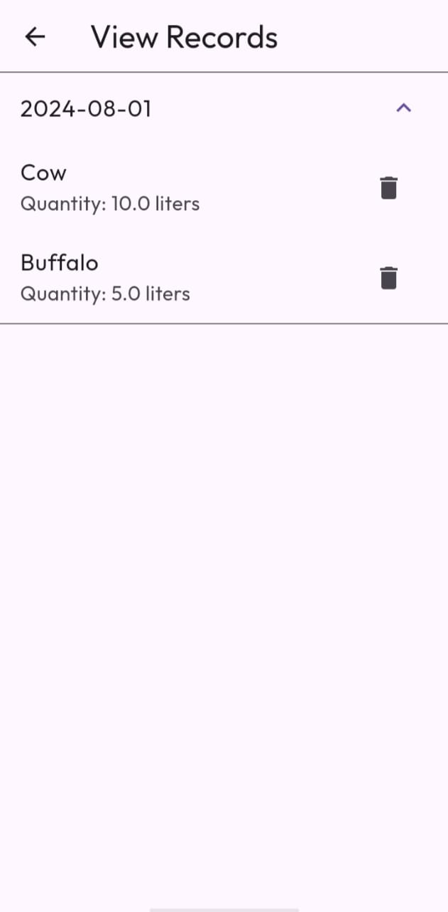
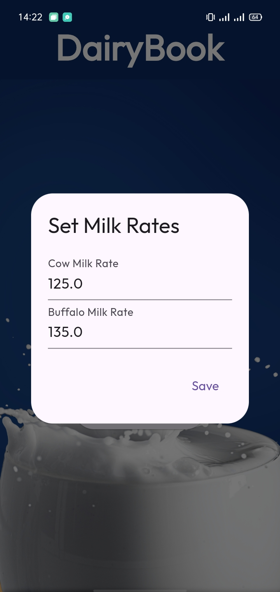
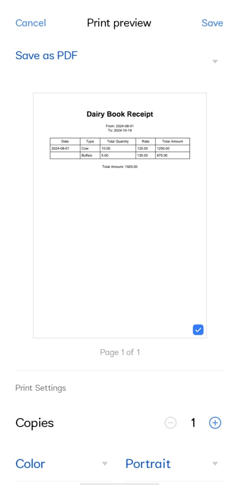

# Dairy Khata

A Customized Flutter App for Milk Sellers (Mostly in Villages)

It includes:
- Splash Screen
- CRUD Operations
- Record Keeping
- Reciept Generation based upon timeline
- Local Storage
- Customized Milk Rates
  
#### App Screenshots

<table>
  <tr>
    <td>Splash Screen</td>
     <td>Home Screen</td>
     <td>Add Record</td>
  </tr>
  <tr>
    <td></td>
    <td></td>
    <td></td>
  </tr>
   
  <tr>
    <td>Local Records</td>
     <td>Milk Rates</td>
     <td>Reciept Generation (based on timeline)</td>
  </tr>
  <tr>
    <td></td>
    <td></td>
    <td></td>
  </tr>
 </table>
