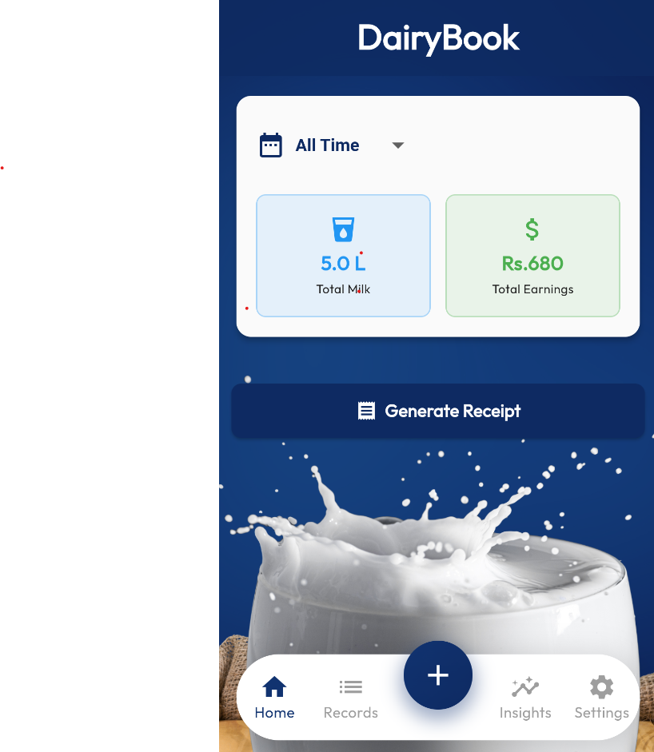
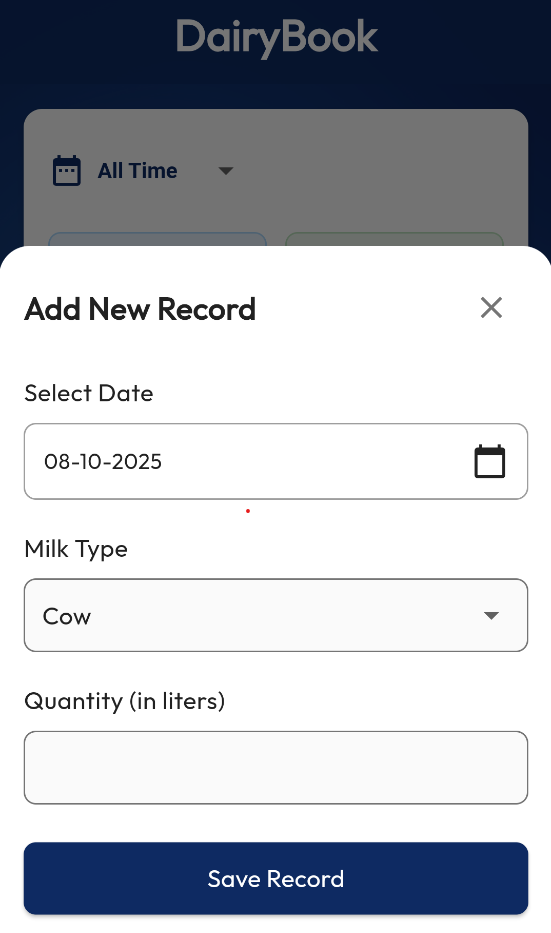
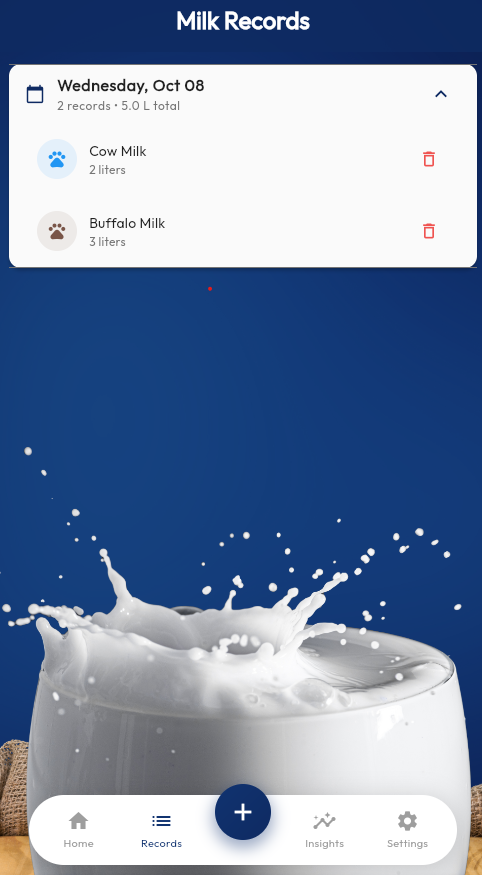
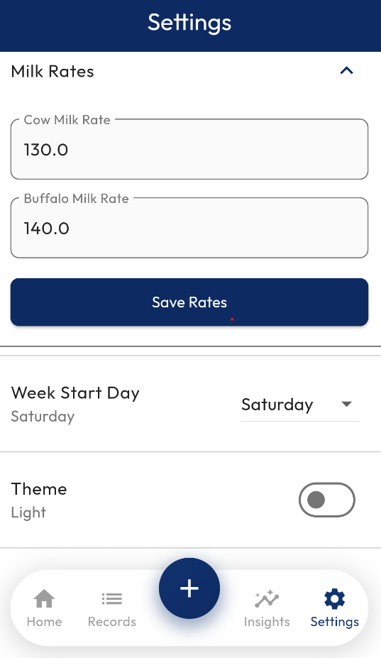
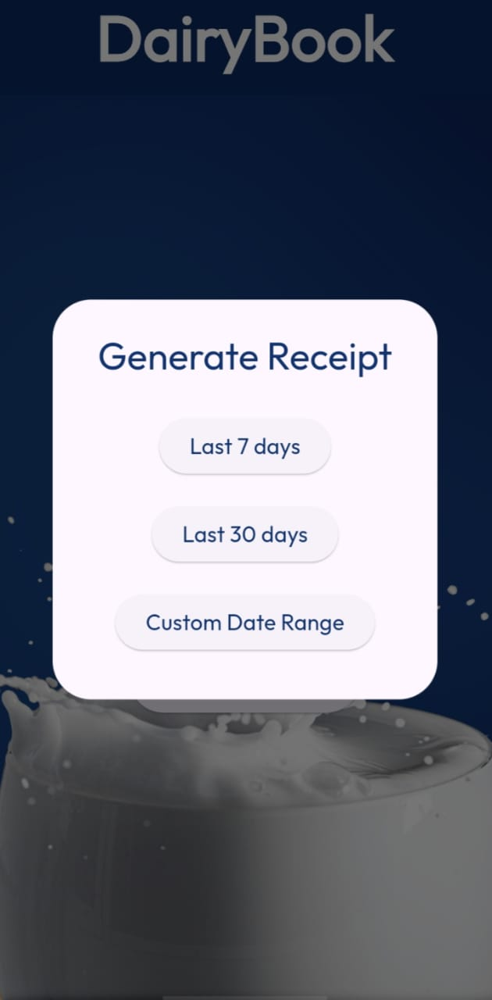

# 🥛 Dairy Khata

[](https://flutter.dev)
[](https://dart.dev)
[](LICENSE)

A comprehensive Flutter application designed for dairy farmers and milk sellers to efficiently manage their business operations. Perfect for rural dairy businesses with offline-first functionality.

## ✨ Features

- **📊 Dashboard Analytics** - Real-time insights on milk production, earnings, and performance
- **➕ Record Management** - Easy CRUD operations for milk collection records
- **🧾 Receipt Generation** - PDF receipts based on custom time periods
- **💰 Custom Pricing** - Flexible milk rates for different types (Cow/Buffalo)
- **📱 Offline Storage** - Local data persistence with Hive database
- **📈 Insights & Reports** - Production analytics and performance tracking
- **🌙 Dark/Light Theme** - Modern UI with theme switching
- **📅 Timeline Filtering** - View records by day, week, month, or custom periods

## 🚀 Tech Stack

- **Framework:** Flutter 3.5+
- **Language:** Dart 3.5+
- **State Management:** Riverpod
- **Database:** Hive (NoSQL)
- **PDF Generation:** pdf + printing packages
- **UI:** Material Design 3

## 📸 Screenshots

<table>
  <tr>
    <td><strong>Splash Screen</strong></td>
    <td><strong>Dashboard</strong></td>
    <td><strong>Add Record</strong></td>
  </tr>
  <tr>
    <td></td>
    <td></td>
    <td></td>
  </tr>
  <tr>
    <td><strong>Records View</strong></td>
    <td><strong>Settings</strong></td>
    <td><strong>Receipt Generation</strong></td>
  </tr>
  <tr>
    <td></td>
    <td></td>
    <td></td>
  </tr>
</table>

## 🛠️ Installation

1. **Prerequisites**
   ```bash
   # Ensure Flutter is installed
   flutter --version  # Should be 3.5 or higher
   ```

2. **Clone the repository**
   ```bash
   git clone https://github.com/NM71/dairykhata.git
   cd dairykhata
   ```

3. **Install dependencies**
   ```bash
   flutter pub get
   ```

4. **Generate code (for Riverpod)**
   ```bash
   flutter pub run build_runner build
   ```

5. **Run the app**
   ```bash
   flutter run
   ```

## 📱 Usage

1. **Launch the app** and you'll see the beautiful splash screen
2. **Set milk rates** in Settings for Cow and Buffalo milk
3. **Add records** using the floating action button
4. **View analytics** on the dashboard with different time filters
5. **Generate receipts** for specific time periods
6. **Browse records** in chronological order with grouping

## 🏗️ Project Structure

```
lib/
├── main.dart                 # App entry point
├── models/                   # Data models
│   └── milk_type_adapter.dart
├── pages/                    # UI screens
│   ├── home_page.dart
│   ├── add_record_page.dart
│   ├── view_records_page.dart
│   ├── insights_page.dart
│   ├── settings_page.dart
│   └── main_navigation.dart
├── providers/                # State management
├── theme/                    # App theming
└── utils/                    # Helper utilities
```

## 🤝 Contributing

Contributions are welcome! Please feel free to submit a Pull Request.

1. Fork the project
2. Create your feature branch (`git checkout -b feature/AmazingFeature`)
3. Commit your changes (`git commit -m 'Add some AmazingFeature'`)
4. Push to the branch (`git push origin feature/AmazingFeature`)
5. Open a Pull Request

## 📄 License

This project is licensed under the MIT License - see the [LICENSE](LICENSE) file for details.

## 🙏 Acknowledgments

- Built with ❤️ for dairy farmers
- Special thanks to the Flutter community
- Icons and assets used are properly licensed

---

**Made with Flutter for the dairy community** 🥛✨
